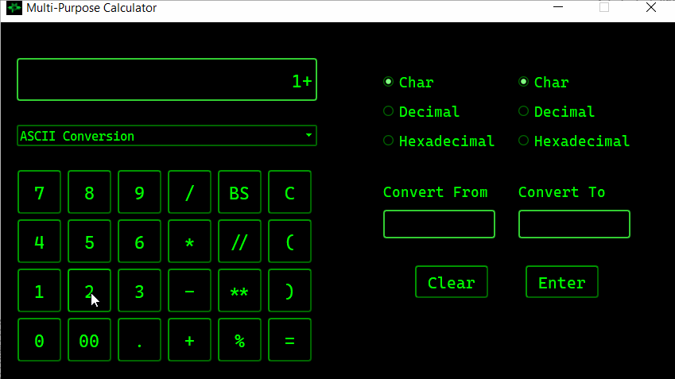
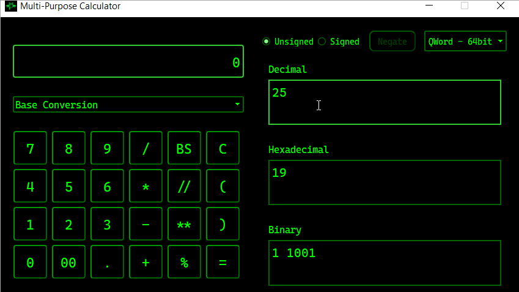
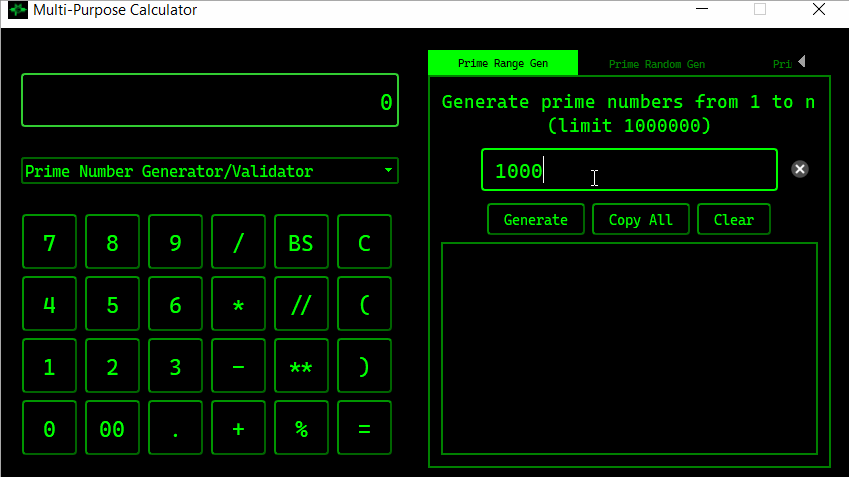
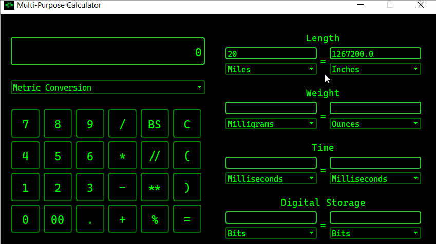
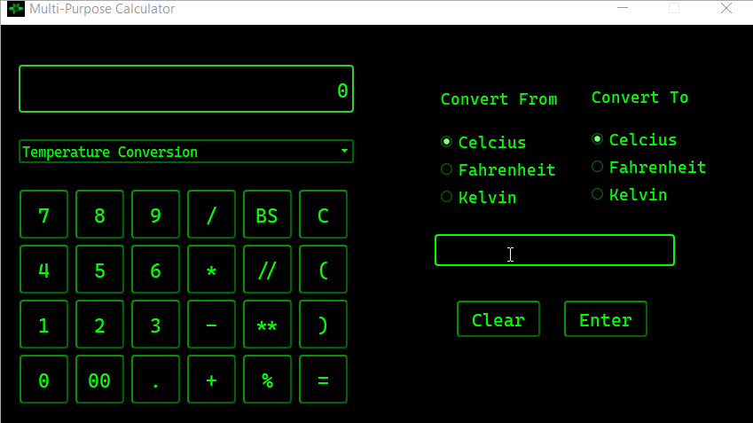
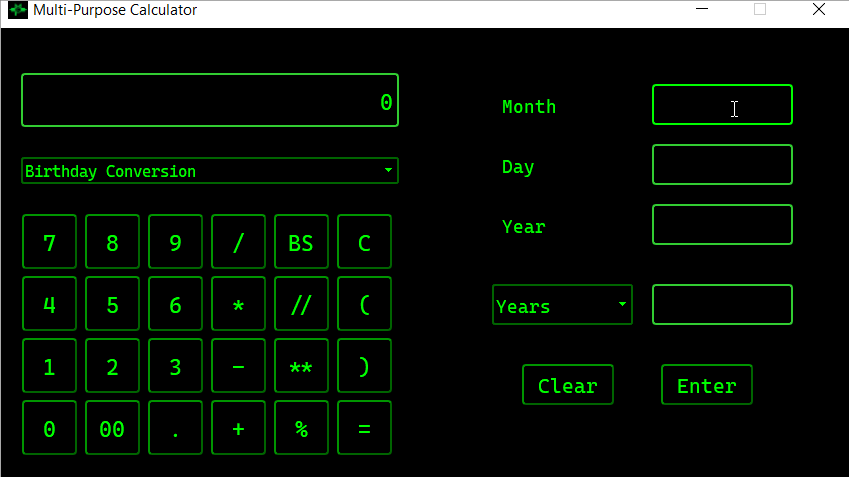

# Multi-Purpose Calculator
## *Made for the sole survivor*

Multi-Purpose Calculator is a stylish calculator application that features two on-sceen calculators and converters.

## Created By

*  [Andrew Alagna](https://github.com/elchic00)
*  [Henry Baum](https://github.com/habmin)
*  [Neslie Fernandez](https://github.com/nesquickcoding)

## Features
### __Basic Calculator__
* Performs basic mathematical functions, such as add, subtract, multiply, division, floor division, modulo, and exponent.
* 

    
Demo

    

### __ASCII Conversion__
* Convert to/from a decimal, hexidecial, and ascii character.
* 

    
Demo

    

### __Base Conversion__
* Instantly convert an integer to/from decimal, hexadecimal, and binary bases. Values can be signed/unsigned with bit widths from 8 to 64-bits
* 

    
Demo

    

### __Prime Number Generator/Validator__ 
* Generate prime numbers, ethier from a range starting at one, or randomlly with a set amount of digits. Also include a validator to determine if a number is prime or not
* 

    
Demo

    

### __Metric Conversion__
* Convert between various units for length, weight, time, and digital storage space
* 

    
Demo

    

### __Temperature Conversion__
* Convert between fahrenheit, celcius, and kelvin
* 

    
Demo

    

### __Birthday Conversion__
* Find out how much time has elapsed when given a date in either years, month, or days
* 

    
Demo

    

## How to install and use:
1. In the terminal, go to the directory you wish to install the Calculator in (using the cd command).
2. Clone our respository by typing 'clone https://github.com/NesQuickCoding/Multi-Purpose-Calculator.git' .
3. Enter your github username and password.
4. Go to the newly cloned directory with 'cd Graphical-App'.
5. Type python main.py .
6. The application will open and is ready to use. Close the application like normal when finished.

### Go to [spec sheet](techspec.md) to see the technical documentation for each class and function.

### Go to [problems sheet](problems.md) to see issues with encountered along with the solutions.

## Designed graphical user interface (GUI) using PyQT5.

The following functionality is completed:

* [x] create at least 4 functions (outside of the classes) 
* [x] create 3 classes for the logic of the application
* [x] need to have a window and at least 6 different widgets on the application
* [x] technical spec detailing your functions, classes and what each does
* [x] a md file which details the problems you ran into and how you solved them

#### Feel free to clone and contribute via a pull request! All ideas are welcome.
